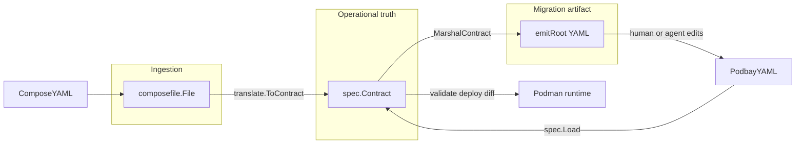
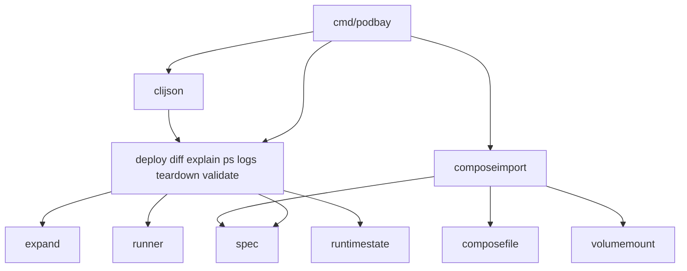
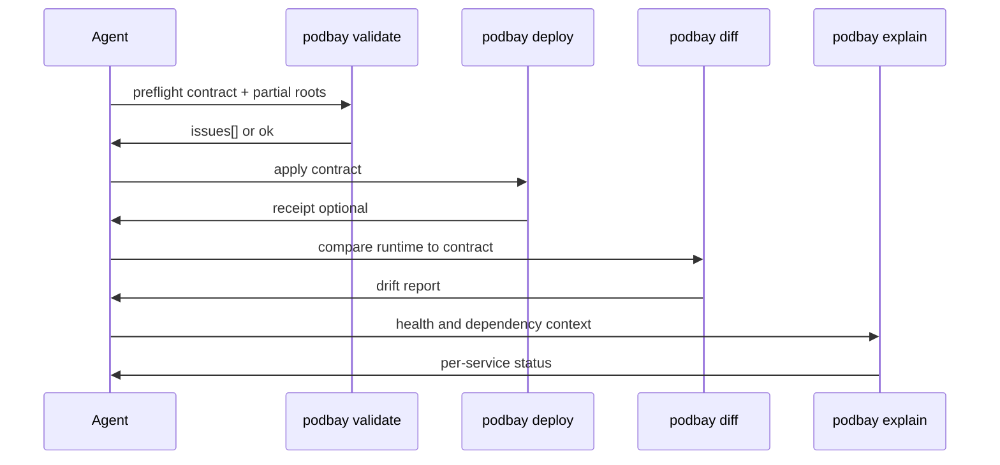

# Podbay architecture

Podbay is a runtime contract layer for Podman stacks. Agents and operators use it to answer: *what should run, is it valid, did we deploy it correctly, and does runtime match the contract?*

This document describes package boundaries and the two main flows: **Compose import** (migration) and the **agent loop** (validate → deploy → observe).

---

## Three import phases (not three duplicate models)

Podbay intentionally has three layers that each carry a Service-shaped document at a different phase. **They are not accidental duplication** — collapsing them would blur boundaries agents and operators need.

| Phase | Package | Question it answers | Used when |
| --- | --- | --- | --- |
| **Foreign input** | `internal/composefile` | What did upstream Compose say? Can we parse/include/extend it? | `podbay import compose` only — never at runtime |
| **Operational contract** | `internal/spec` | What should run? Is it valid? Deploy it. Did it drift? | validate, deploy, diff, explain, ps, logs, teardown |
| **Migration output** | `internal/composeimport` (`emit_types`) | What first-pass `podbay.yaml` should the agent commit or hand-edit? | `import compose -o` / `--json contract_yaml` only |

### Why each layer exists

1. **`composefile`** — Compose dialect boundary. Handles `include:`, `extends:`, Compose `healthcheck:` (not Podbay `health:`), `StringOrMap` environment, configs/secrets refs, and Compose port syntax. Produces stable import failure codes (`import_include_cycle`, etc.) for agent error handling. Runtime commands never import this package.

2. **`spec`** — Canonical runtime contract. Normalized dependency graph, Podbay health model, `dependents` validation, `PodmanSection`, and partial-deploy resolution. **This is the single operational truth** for the validate → deploy → diff agent loop.

3. **`emit_types`** — Serialization policy for migration output, not a third operational model. `composeimport/emit.go` marshals `spec.Contract` through `emitRoot` because import output has presentation rules `spec` struct tags alone do not express:
   - `dependsOnForEmit` — short list when all conditions are `started`, map form when `healthy` edges exist
   - `mergedDependentsYAML` — derives `dependents:` from inverse `depends_on` so imported contracts pass bidirectional validate without hand-editing
   - Omits empty maps and controls field ordering for `spec.Load`-compatible first-pass output

When adding a field, see [contract-change-checklist.md](contract-change-checklist.md) for which layers to touch.

---

## Package import DAG

Runtime and CLI packages fan in through `spec`. Import stays isolated from deploy/diff except through `spec.Contract`.

Leaf packages (no internal Podbay deps): `spec`, `expand`, `vault`, `composefile`, `receipt`, `volumemount`.

---

## Agent loop

The primary automation path chains JSON-stable gates on the same contract semantics:

### Unified semantics (Sprints 26–27)

Two shared helpers keep validate, deploy, and observability commands aligned:

| Concern | Helper | Packages |
| --- | --- | --- |
| **Which services are in scope** (profiles, partial roots, `--dependents`) | `spec.ObservabilityActiveServices` | validate, deploy, diff, ps, explain, logs, teardown |
| **Host `${VAR}` substitution** on service fields before use | `expand.ExpandService` | validate, deploy, explain (+ receipt/status paths) |

If these diverge across commands, an agent can pass `podbay validate web`, deploy successfully, then see `podbay diff web` report a different expected service set or expanded field values. Both helpers live in one place so the agent loop stays consistent.

Partial-deploy demos: `examples/ci-partial-agent-loop-demo.sh`.

---

## Deploy pipeline (`internal/deploy`)

`deploy.Deploy()` applies the contract in numbered phases. Phase logic lives in focused files; `deploy.go` is a thin orchestrator.

| Phase | Function | File |
| --- | --- | --- |
| 1. Setup | `newDeployContext` — Podman check, host env, active service set, progress logging | `deploy_context.go` |
| 2. Networks | `prepareNetworks` — project bridge or multi-net ensure | `networks.go` |
| 3. Volumes | `prepareVolumes` — logical volumes and mount validation | `volumes.go` |
| 4. Services | `deployServicesInOrder` — topo-ordered build, vault mounts, start, health gates | `services.go` |
| 5. Receipt | `writeDeployReceipt` — optional post-success deploy receipt | `receipt.go` |

Health gate waiting (`waitServiceHealth`) and structured health failures live in `health_wait.go` and `health_gate_failure.go`. Ansible vault bind materialization lives in `vault_materialize.go`.

---

## Operational commands and `spec`

| Command | Loads contract | Uses `ObservabilityActiveServices` | Uses `expand.ExpandService` |
| --- | --- | --- | --- |
| validate | yes | yes | yes |
| deploy | yes | yes | yes |
| diff | yes | yes | no |
| explain | yes | yes | yes |
| ps / logs | yes | yes | no |
| teardown / down | yes | yes | no |
| import compose | no (Compose source) | no | no |

---

## Related docs

- [contract.md](contract.md) — `podbay.yaml` reference, networks, profiles, Compose import
- [cli-json.md](cli-json.md) — `--json` envelopes, receipts, exit behavior
- [agent-loop.md](agent-loop.md) — validate → deploy → diff automation
- [glossary.md](glossary.md) — terminology across CLI, JSON, and Go
- [contract-change-checklist.md](contract-change-checklist.md) — which layers to update per change type
- [README.md](../README.md) — project overview and quick start
- [RELEASES.md](../RELEASES.md) — shipped scope and version history
